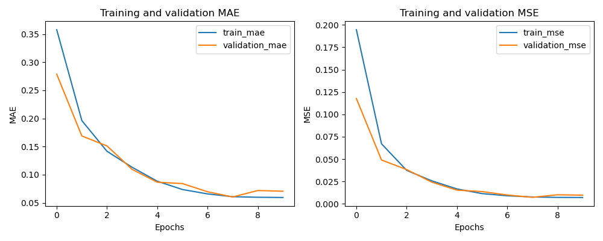
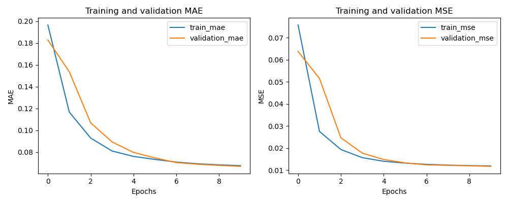
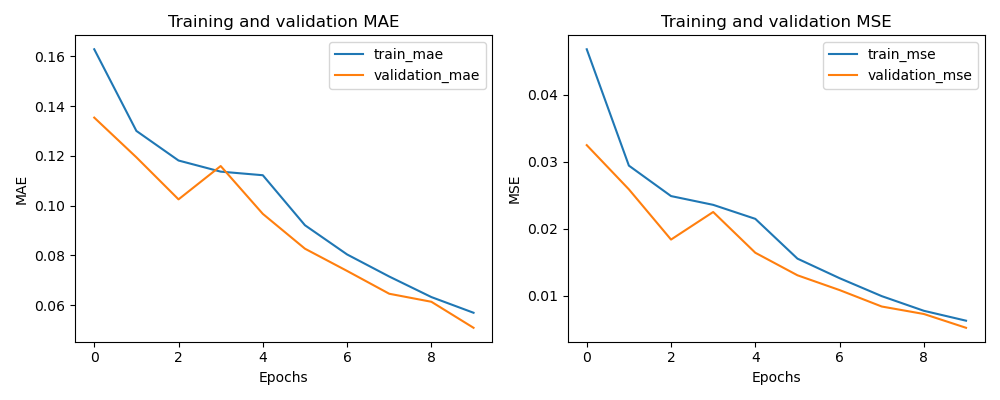
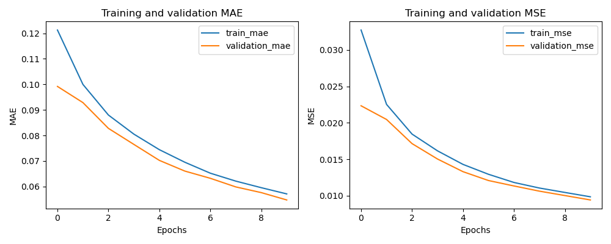

# Final Project

I used 2 different types of neural networks to predict the future weather data. I misread the assignment document and predicted all the types of weather data including precipitation, wind, and soil temperature, rather than just humidity, temperature, and pressure. I did create corrected versions of each, but it didn't change that much. The support code is based on code from assignment 5.

## Functionality

The models performed well. Predictably, the LSTM model took longer to train than the CNN model due to the increased amount of data.

## Implementation

The models were implemented using Keras and Tensorflow. Both models are Sequential models built up from layers of the appropriate type.

### Convolutional Neural Network

The CNN model is built from a series of convolution, pooling, normalization, and dropout layers. The final output layers are dense layers and flattening layers to achieve the correct data output shape.

### Long Short Term Memory

The LSTM model is built from a series of LSTM, dropout, and dense layers. The first 2 layers are LSTM with 50 neurons to learn fine grained temporal patterns, before it is shrunk down to the desired output shape. There are then 2 more LSTM layers, a dropout layer, and a time-distributed dense layer to output the final data. I had some trouble getting the correct output shape, which is how I ended up using a time-distributed dense layer to output the correct shape.

## Data

As discussed above, I initially created 41-feature models that predicted all types of weather data. While writing the report, I realized this and altered the models to only predict the 8 features required. This didn't change the models much and mostly consisted of changing the input and output layers.

To load the data, I used numpys `loadtxt` function and a modified version of the windowing code from assignment 5. The data is retrieved from a sliding window that contains both the input data and the output data (12+3 and 6+1 hours respectively). Because the data is provided by the minute, these windows are actually 60 times as long. Within the larger window, the input data is placed into one array and the output data into another.

### Normalization

This provides data in a 3d array of (batch, timesteps, features). This data is then normalized to a (0,1) range using the `MinMaxScaler` from sklearn. The scaler only works on 2d arrays, so the batch and timesteps are temporarily squashed to normalize the feature dimension.

### Splitting

Finally, the batched and normalized data is split into training and testing sets using the `train_test_split` function from sklearn, with the test set being 20% of the data.

## Performance

I've included both the 8 and 41 feature models in the report because I made both, but only the 8 feature model is technically relevant to the assignment.

### Convolutional Neural Network (8 features)

### Convolutional Neural Network (41 features)

### Long Short Term Memory (8 features)

### Long Short Term Memory (41 features)

