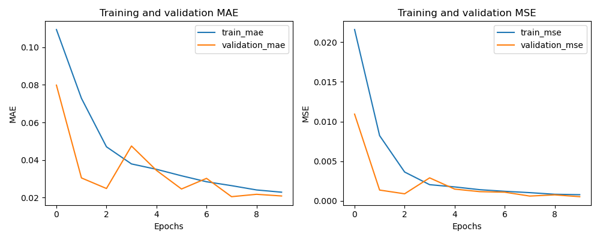
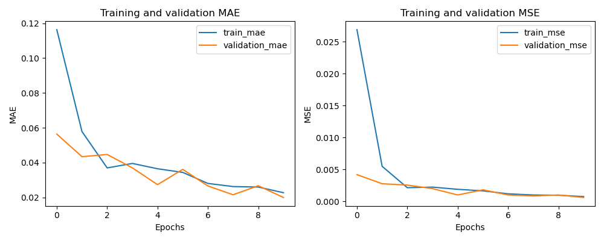
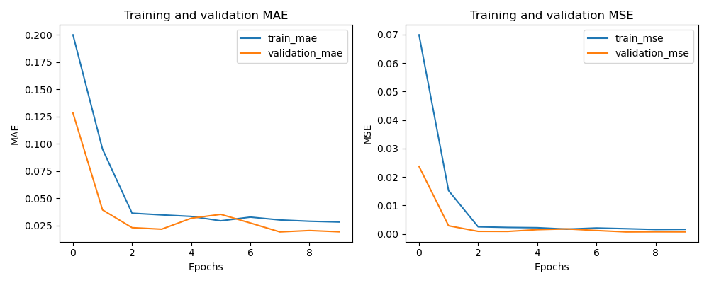

# Homework 5

All the optimizers I tested were very similar. ADAM and LION were basically the same. Adafactor converged faster but was slightly worse.

## Initial Model

## LION Optimizer

## Adafactor Optimizer

