# Homework 4

## Original 4-Layer Model

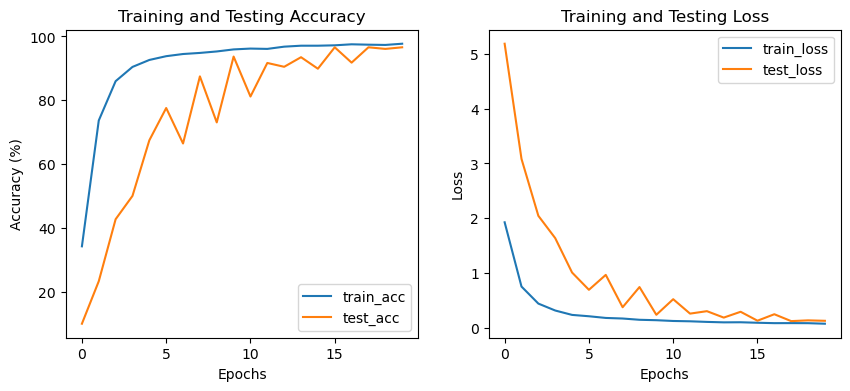

```
The 16 epoch achieves the best model, Test Loss: 0.1283, Test accuracy: 96.60%
```

## Modified 6-Layer Model

The 6-layer model required changes to pooling to be functional. When using 6 layers, the pooling layer shrunk the data to a size of 0 at the 5th layer and crashed the model.

```
RuntimeError: Given input size: (Nx1x1). Calculated output size: (Nx0x0). Output size is too small
```

My solution was to disable pooling for 2 of the layers.

### Growing hidden layer size

Continuing from layer 4, the number of channels was doubled in each layer (128 -> 256 -> 512)

The training was much slower than the smaller model, but reached its peak by epoch 13. Beyond that it began overfitting.

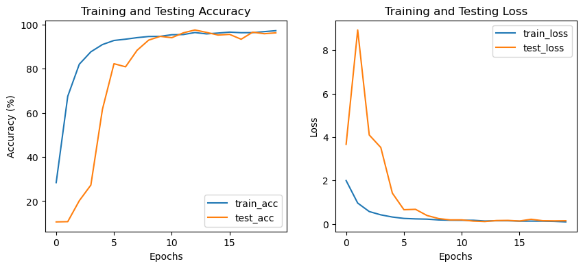

```
The 13 epoch achieves the best model, Test Loss: 0.1068, Test accuracy: 97.60%
```

There were other attempts at 6-layer models, but this is the one that I will use for the remainder of the modifications.

## Data Augmentation

The different augmentations did not significantly affect the results.

### Random Affine

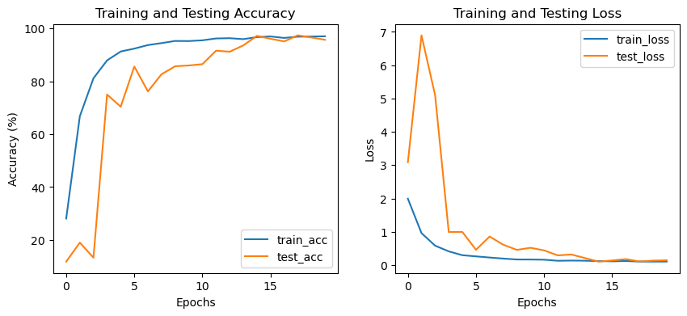

```
The 18 epoch achieves the best model, Test Loss: 0.1074, Test accuracy: 97.40%
```

### Random Vertical Flip

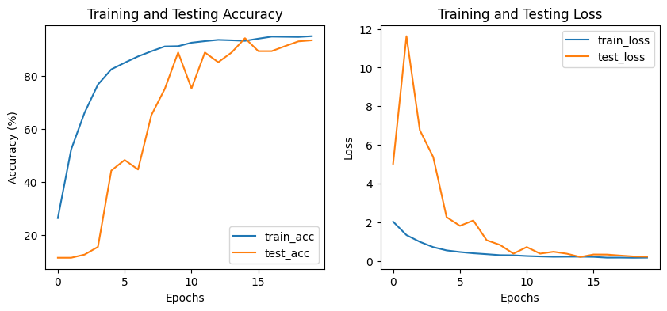

```
The 15 epoch achieves the best model, Test Loss: 0.2070, Test accuracy: 94.40%
```

## Optimizers and Learning Rates

ADAM and Adagrad preferred a middle-ground learning rate around 0.01

### ADAM (Learning Rate 0.05)

The higher learning rate resulted in some underfitting and high variability with the ADAM optimizer.

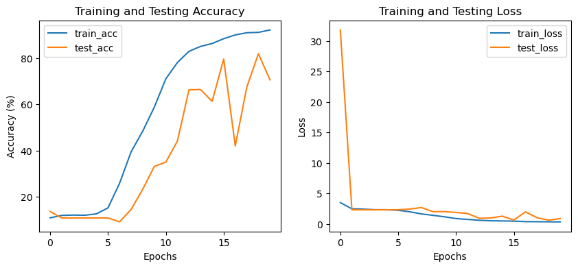

```
The 19 epoch achieves the best model, Test Loss: 0.6100, Test accuracy: 81.90%

```

### ADAM (Learning Rate 0.01)

ADAM performed the best at a learning rate of 0.01. No significant under or overfitting was observed.

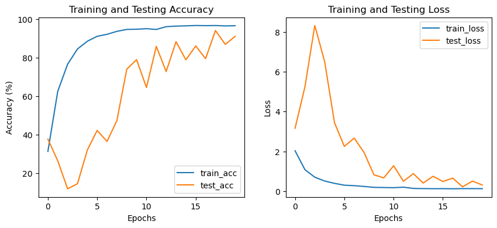

```
The 18 epoch achieves the best model, Test Loss: 0.2229, Test accuracy: 94.10%

```

### ADAM (Learning Rate 0.001)

At a learning rate of 0.001, there was slightly more overfitting.

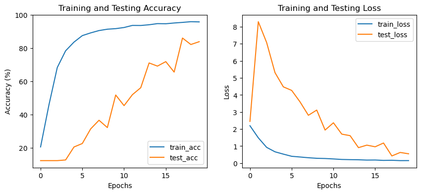

```
The 18 epoch achieves the best model, Test Loss: 0.4210, Test accuracy: 86.00%

```

### Adagrad (Learning Rate 0.05)

Adagrad had significant overfitting at a learning rate of 0.05.

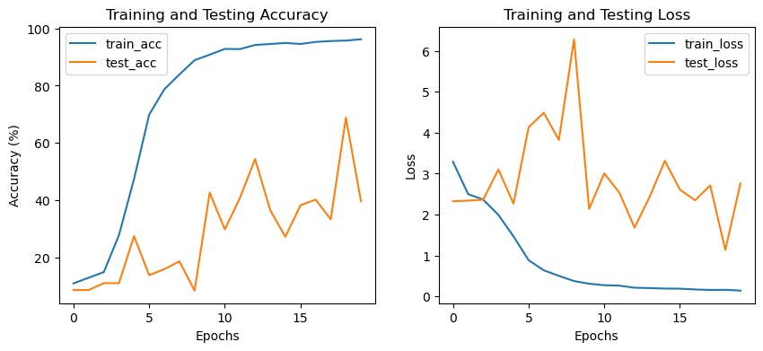

```
The 19 epoch achieves the best model, Test Loss: 1.1350, Test accuracy: 68.80%

```

### Adagrad (Learning Rate 0.01)

Adagrad performed best at a learning rate of 0.01 with no significant over or underfitting.

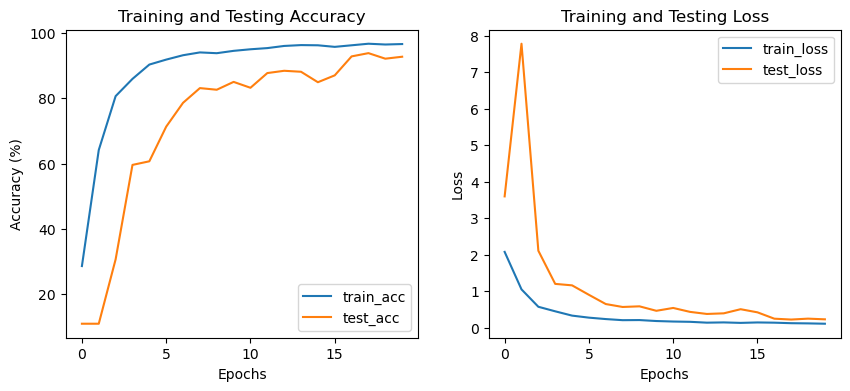

```
The 18 epoch achieves the best model, Test Loss: 0.2251, Test accuracy: 93.80%

```

### Adagrad (Learning Rate 0.001)

Adagrad was severly overfit at a learning rate of 0.001.

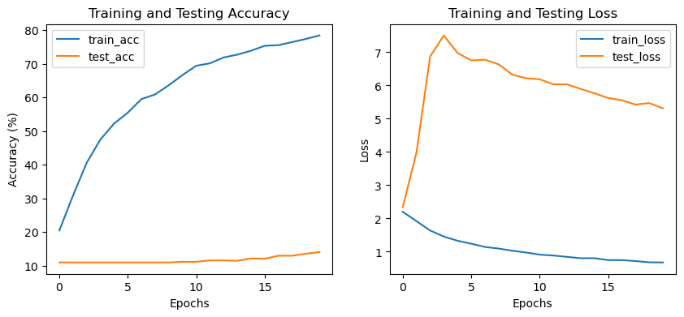

```
The 20 epoch achieves the best model, Test Loss: 5.3135, Test accuracy: 14.10%

```

### SGD (Learning Rate 0.1)

SGD performed best with higher learning rates. The highest tested was 0.1.

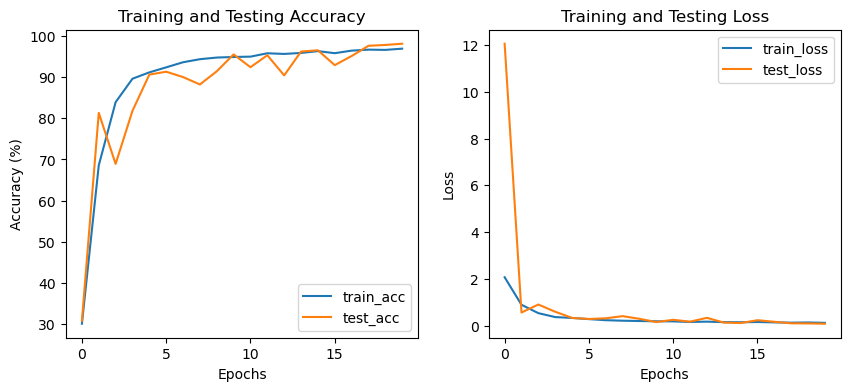

```
The 20 epoch achieves the best model, Test Loss: 0.0772, Test accuracy: 98.10%

```

### SGD (Learning Rate 0.05)

SGD performed worse the lower the learning rate.

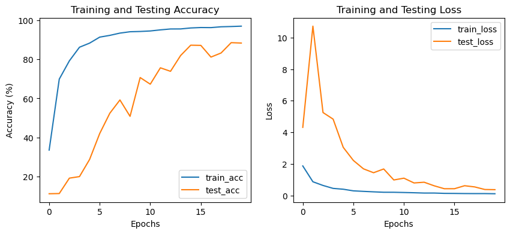

```
The 19 epoch achieves the best model, Test Loss: 0.3794, Test accuracy: 88.60%

```

### SGD (Learning Rate 0.01)

Below 0.01, SGD began to see significant overfitting.

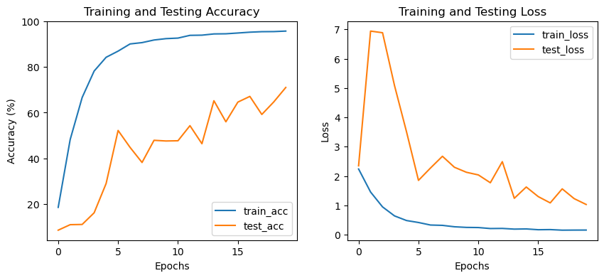

```
The 20 epoch achieves the best model, Test Loss: 1.0317, Test accuracy: 71.00%

```

### SGD (Learning Rate 0.001)

At 0.001, SGD was completely overfit and was barely better than random chance.

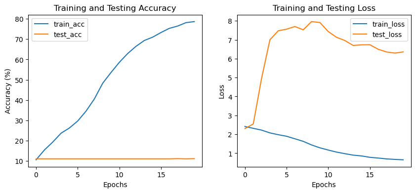

```
The 18 epoch achieves the best model, Test Loss: 6.3554, Test accuracy: 11.10%

```

## Other 6-layer experiments

These are the other, less successful 6-layer models.

### Shrinking hidden layer size

Starting at layer 4, the number of channels was cut in half in each layer (128 -> 64 -> 32)

The model was underfit on training data, but performed similarly to the 4-layer model on the test data.

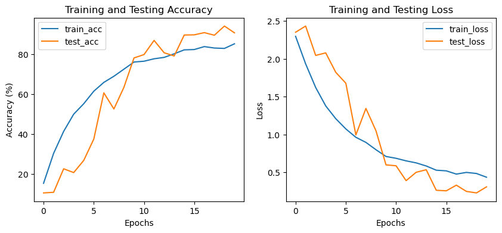

```
The 19 epoch achieves the best model, Test Loss: 0.2276, Test accuracy: 94.20%
```

### No size change

The additional 2 layers did not change the number of channels (128 -> 128 -> 128)

This model was overfit to the training data.

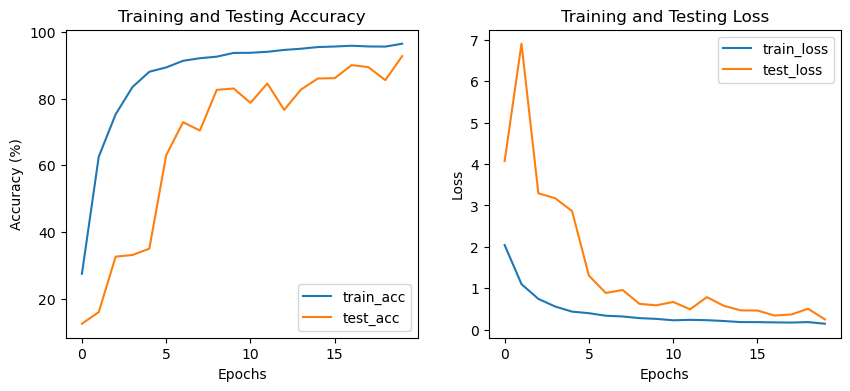

```
The 20 epoch achieves the best model, Test Loss: 0.2486, Test accuracy: 92.70%
```

### "6"-layer model

This is a mock 6-layer model created by adding 4 more convolutional layers to the 4th layer. It performed almost the same as the best of the actual 6-layer models but I did not include it because it wasn't actually a 6-layer model.

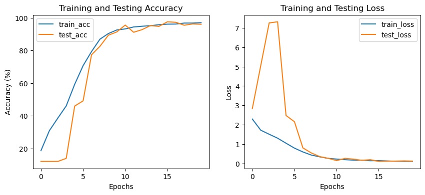

The 16 epoch achieves the best model, Test Loss: 0.1077, Test accuracy: 97.50%
